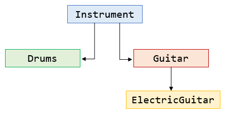

# OOP - Principles
Presented solution introduces the rules of OOP. It's been developed for the PROE (ang. Object-Oriented Programming) course.
## Brief description
This console UI app has been created to become familiar with fundamental rules of **Object Oriented Programming**. In my program I focused on following things:

* Inheritance
* Abstract class
* Virtual methods
* Operators overloading
* Class type-casting
* SDL library

Depicted class hierarchy is in the ```~/Resources``` folder. **Remark:** This is one of my first programming projects, so several rookie mistakes can be found here e.g. bad variables naming.
<!--
||
|:-------------------------:|
|*Class hierarchy*|
-->
## Getting started
Recommened environment: Visual Studio 2017+ (with C++ tools)
- [X] Build solution within VS IDE so that ```~/x64/Debug``` folder is created
- [X] To run application you can use ```RunApp.bat```

**Author:**

Krzysztof Sadura
